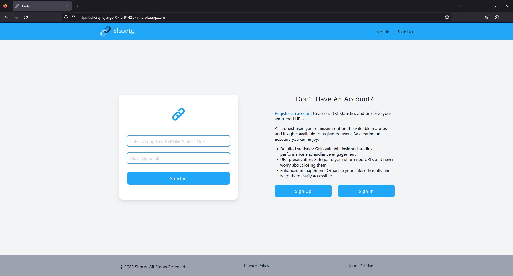
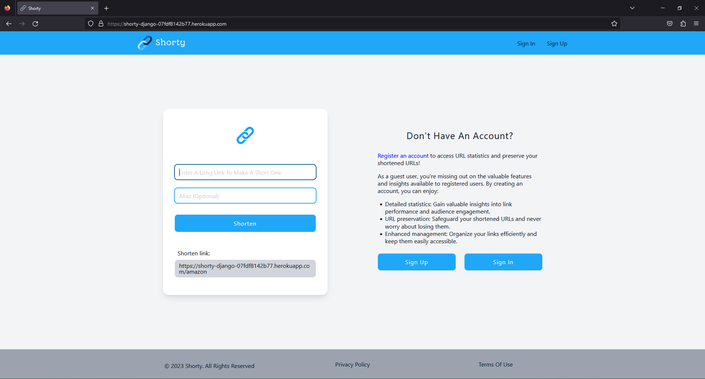
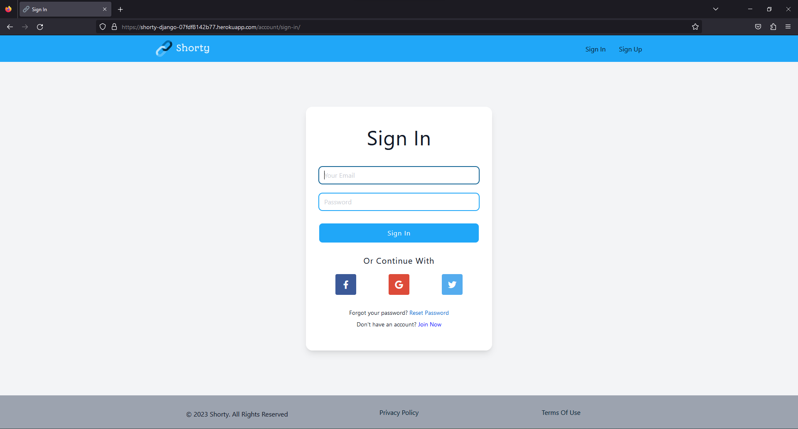
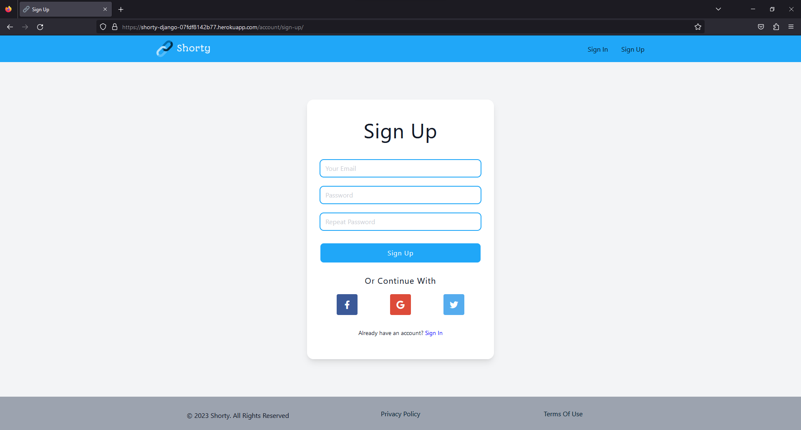
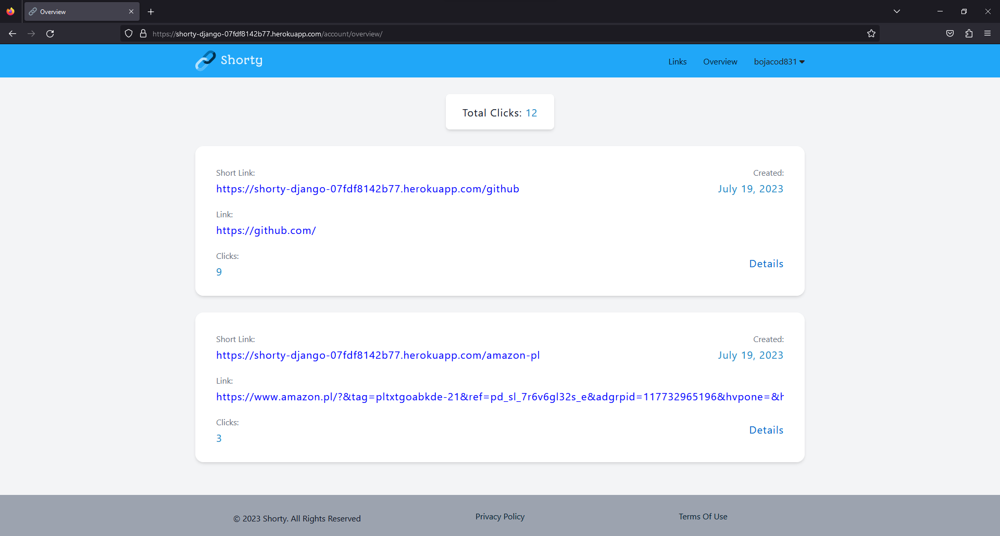
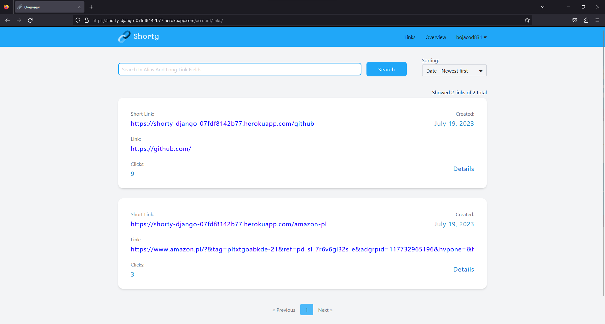
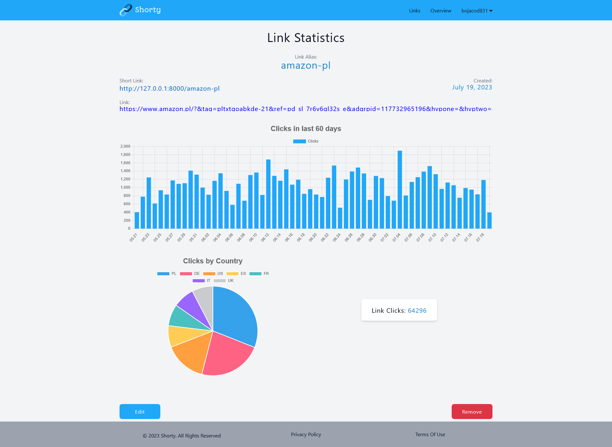
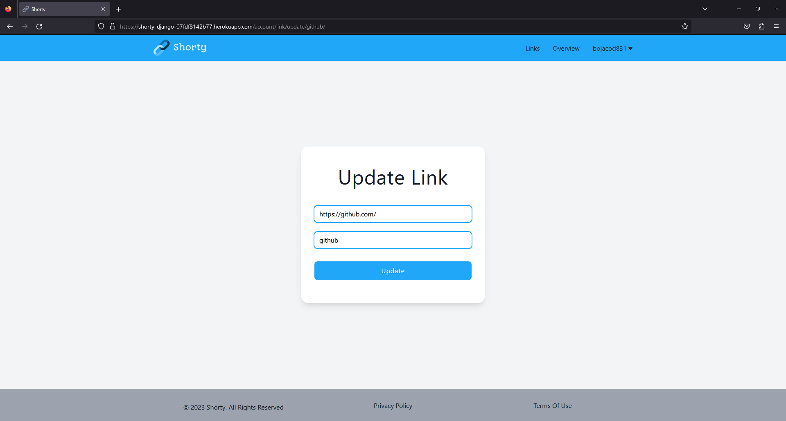
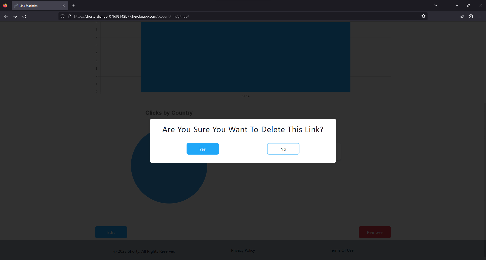

# [Shorty](https://shorty-prod-23d1a8e9a3fc.herokuapp.com/)

### Remark
It must be assumed that the site is under a short domain, for example `shorty.com`

### Description
This is a Django web application. On this website you can short any link with custom or random alias. If you will be logged in during shorting process, you can check link statistics.

You can view the site at [this link](https://shorty-prod-23d1a8e9a3fc.herokuapp.com/) or with the help of the video and images below.

Website link: https://shorty-prod-23d1a8e9a3fc.herokuapp.com/

## Technologies

- Python
- Django
- PostgreSQL
- Redis
- Celery
- NGINX

Project hosted by [heroku](https://www.heroku.com/home).

# Project presentation
Demo video:

https://github.com/andreistr21/Link-Shortener/assets/60103919/c638d18c-3b91-4143-9865-9030dd0c98ee

Main page, where user can short link.

Main page after link was shortened.

Login page.

Register page.

Overview page with 2 links. Can show only 3 links maximum. At the top, the total count for all user links is shown.

Links page with two links. On one page can be shown up to 5 links, if there are more links, more pages will be available. At the top is the search bar and sort drop down menu.

Link statistics page with a lot of clicks. The page contains link data and statistics data, which includes graph with clicks by days, pie chart with clicks by each country and total clicks for this link. Also, at the bottom, there is are edit and remove buttons.

Edit page, where user can edit links data.

Remove dialog, where user need to confirm or not link deletion. Same for logout process.

